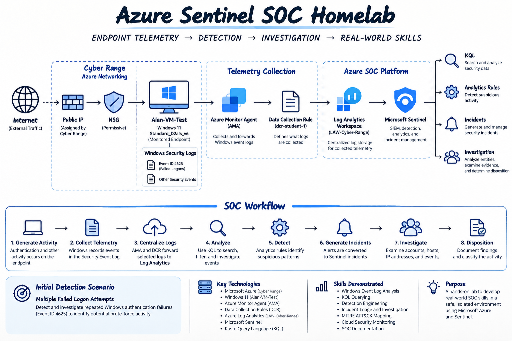

# Azure Sentinel SOC Homelab – Planning

## Objective

The goal of this project is to build a Microsoft Azure SOC homelab using Microsoft Sentinel.

This lab provides hands-on experience with:

- Microsoft Sentinel
- Azure Log Analytics
- Windows Security Events
- Kusto Query Language (KQL)
- Analytics Rules
- Incident Detection
- SOC Investigation

## Lab Environment

The lab consists of a Windows 11 virtual machine connected to Microsoft Sentinel through an Azure Log Analytics workspace.

Security events generated on the virtual machine are collected and analyzed in Sentinel to simulate real-world SOC monitoring and investigation.

## Architecture

## Detection Scenario

The primary detection scenario focuses on multiple failed Windows logon attempts.

Windows Security Event ID **4625** is collected and analyzed using KQL. A Microsoft Sentinel analytics rule detects **five or more failed logon attempts within five minutes** and generates an incident for investigation.

## SOC Workflow

Windows VM → Security Events → Log Analytics → Microsoft Sentinel → KQL → Analytics Rule → Incident → Investigation
