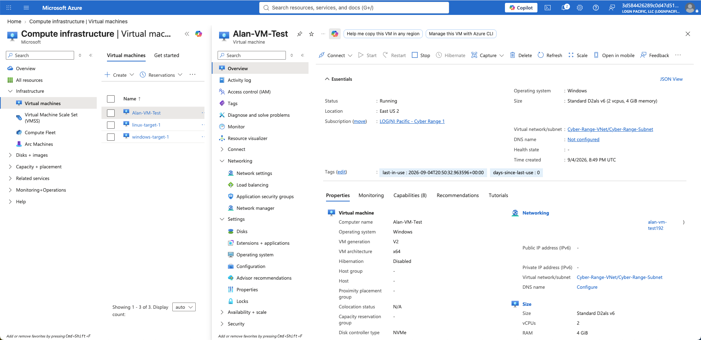

# Azure Lab Environment

## Overview

The Azure lab environment serves as the foundation for the entire Azure Sentinel SOC Homelab.

This project was built within an online cybersecurity training resource called the **Cyber Range**, created by **Josh Madakor**. The Cyber Range provides access to Microsoft Azure resources that can be used to build hands-on cybersecurity labs and gain practical experience working with cloud and security technologies.

For this project, I used the Cyber Range to deploy and configure a Windows 11 virtual machine and connect it to the Azure security monitoring infrastructure used throughout the SOC homelab.

The environment provides the foundation for each stage of the project, including endpoint configuration, log collection, KQL analysis, detection engineering, and incident investigation.

---

## Azure Environment

The SOC homelab uses several Microsoft Azure resources working together to provide the infrastructure for the project.

The environment includes:

- Windows 11 Virtual Machine
- Public IP Address
- Network Interface
- Virtual Network
- Network Security Group
- Azure Monitor Agent
- Data Collection Rule
- Log Analytics Workspace
- Microsoft Sentinel

Some of the Azure infrastructure, including shared networking and security monitoring resources, was already provided through the Cyber Range. My primary responsibility was configuring the Windows endpoint and connecting it to the existing monitoring environment.

---

## Windows 11 Virtual Machine

A Windows 11 virtual machine named `Alan-VM-Test` was deployed within the Azure Cyber Range as the primary endpoint for the SOC homelab.

The VM serves as the system being monitored throughout the project. Security activity generated on the endpoint produces Windows Security Event logs that can be collected, analyzed, and investigated using Azure and Microsoft Sentinel.

The virtual machine was used throughout the lab to:

- Generate Windows security activity
- Produce Windows Security Event logs
- Validate security telemetry collection
- Test KQL queries
- Generate controlled suspicious activity
- Trigger Microsoft Sentinel detections
- Investigate resulting security incidents

Using a dedicated Windows endpoint allowed me to follow security activity from its origin on the host through the complete SOC monitoring and investigation process.

---

## Azure Networking

The virtual machine operates within the networking infrastructure provided by the Cyber Range.

The networking environment includes an Azure Virtual Network, subnet, Network Security Group, network interface, and public IP address.

The Network Security Group controls traffic at the Azure network layer, while Windows Defender Firewall provides an additional security layer directly on the Windows endpoint.

Understanding the difference between these controls became important when configuring and testing the honeypot.

More details about the endpoint security configuration are documented in:

`03-Honeypot-Configuration`

---

## Log Analytics Workspace

The Cyber Range provides a shared Log Analytics workspace named `LAW-Cyber-Range`.

The workspace acts as the central location for storing and querying security telemetry collected from monitored systems in the Cyber Range.

For this project, Windows Security Events generated by `Alan-VM-Test` are forwarded to this workspace and later analyzed using Kusto Query Language (KQL).

---

## Microsoft Sentinel

Microsoft Sentinel is connected to the `LAW-Cyber-Range` Log Analytics workspace and provides the SIEM platform used throughout the project.

Sentinel is used to:

- Analyze Windows security telemetry
- Run KQL queries
- Create custom analytics rules
- Generate security alerts
- Create incidents
- Investigate account and host activity
- Map detections to MITRE ATT&CK

The detailed Sentinel detection and investigation process is documented later in the project.

---

## Environment Data Flow

The Azure environment provides the foundation for the security monitoring pipeline used throughout the homelab:

**Windows 11 VM → Windows Security Events → Azure Monitor Agent → Data Collection Rule → Log Analytics Workspace → Microsoft Sentinel**

With the Azure environment established, the next step was configuring the Windows virtual machine to function as the monitored honeypot endpoint.
