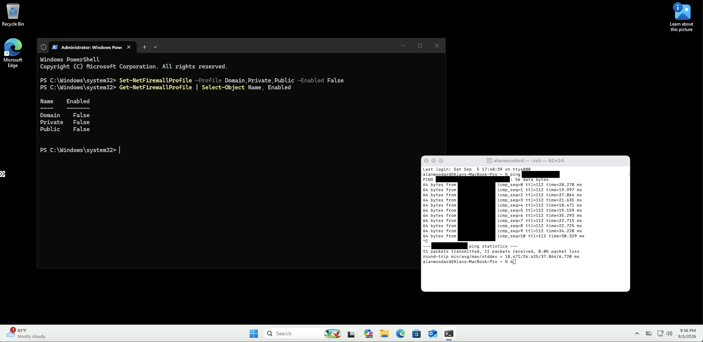
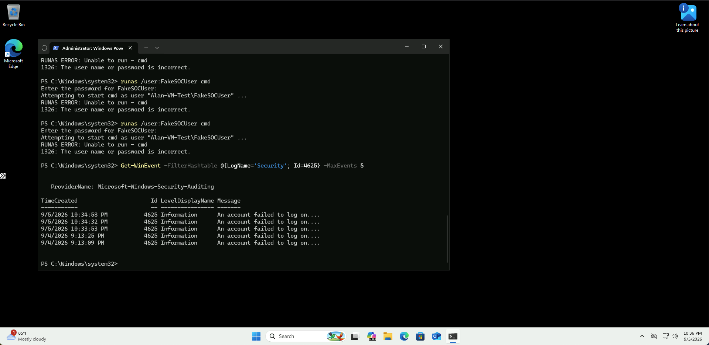

# Honeypot Configuration

## Overview

The Windows 11 virtual machine was configured as a controlled security testing endpoint for the SOC homelab.

The purpose of this configuration was to create an environment where I could intentionally generate security activity, observe the Windows events created by that activity, and later analyze those events using Microsoft Sentinel.

This allowed me to follow security activity from the endpoint where it occurred through the detection and investigation process used throughout the rest of the lab.

---

## Windows Firewall and Connectivity Testing

Before generating security events, I tested connectivity to the Windows 11 virtual machine.

Windows Defender Firewall was initially enabled for the Domain, Private, and Public profiles. A connectivity test from my local computer to the virtual machine was unsuccessful while these firewall profiles were enabled.

For the purposes of this isolated lab environment, I disabled the Windows Defender Firewall profiles using PowerShell:

`Set-NetFirewallProfile -Profile Domain,Private,Public -Enabled False`

I then verified the firewall status and repeated the connectivity test.

After the firewall profiles were disabled, the virtual machine successfully responded to the connectivity test.

Disabling the host firewall was performed specifically for this controlled lab environment to support testing and connectivity. This would not be an appropriate security configuration for a normal production endpoint.

---

## Controlled Failed Logon Activity

After configuring the test endpoint, I generated controlled failed authentication attempts using a local test account named `FakeSOCUser`.

The following command was used to attempt to start a command prompt under the test account:

`runas /user:FakeSOCUser cmd`

Incorrect credentials were intentionally entered multiple times, causing Windows to reject the authentication attempts.

This simulated authentication behavior that could be investigated as possible password guessing or brute-force activity in a SOC environment.

---

## Verifying Windows Security Events

After generating the failed authentication attempts, I used PowerShell to verify that Windows recorded the activity in the Security event log.

The following command was used to retrieve recent failed-logon events:

`Get-WinEvent -FilterHashtable @{LogName='Security'; Id=4625} -MaxEvents 5`

The results confirmed that the failed authentication attempts generated:

**Windows Security Event ID 4625 — An account failed to log on**

This confirmed that the test activity was successfully being recorded by Windows and provided security telemetry that could later be collected and analyzed.

---

## Lab Workflow

At this stage of the project, the workflow was:

Windows 11 Test Endpoint  
↓  
Controlled Authentication Activity  
↓  
Failed Logon Attempts  
↓  
Windows Security Event ID 4625  
↓  
Security Telemetry Ready for Collection

The next phase of the project focuses on collecting Windows Security events in Azure Log Analytics and using Kusto Query Language (KQL) to analyze the resulting security data.
