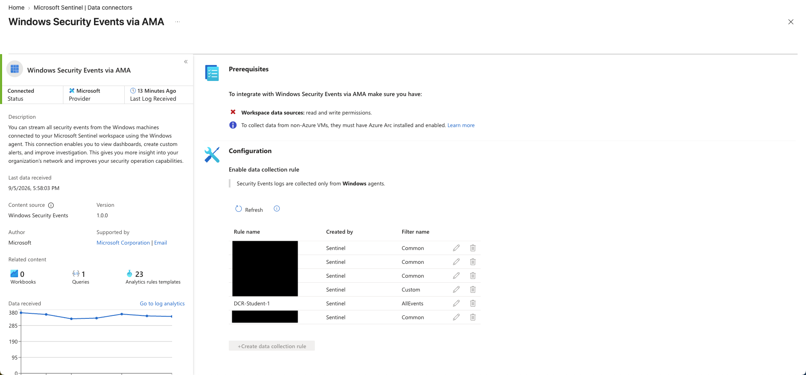
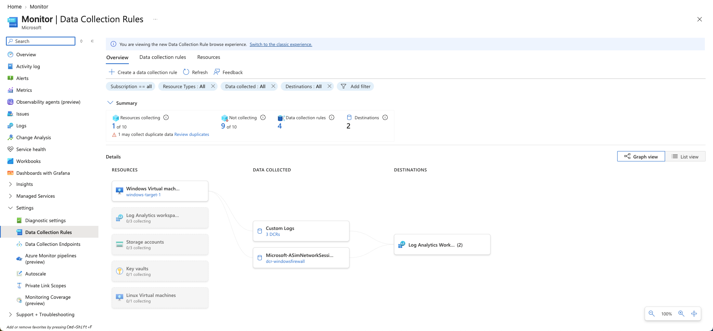
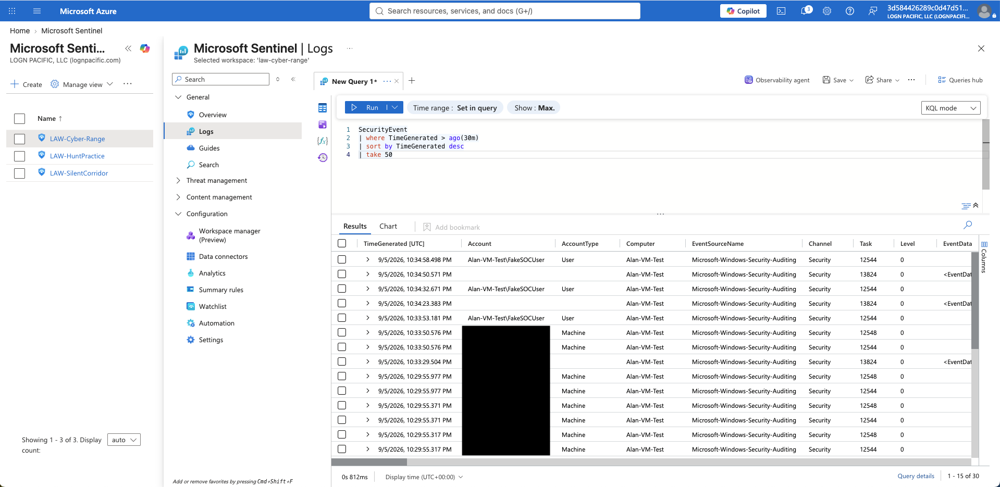
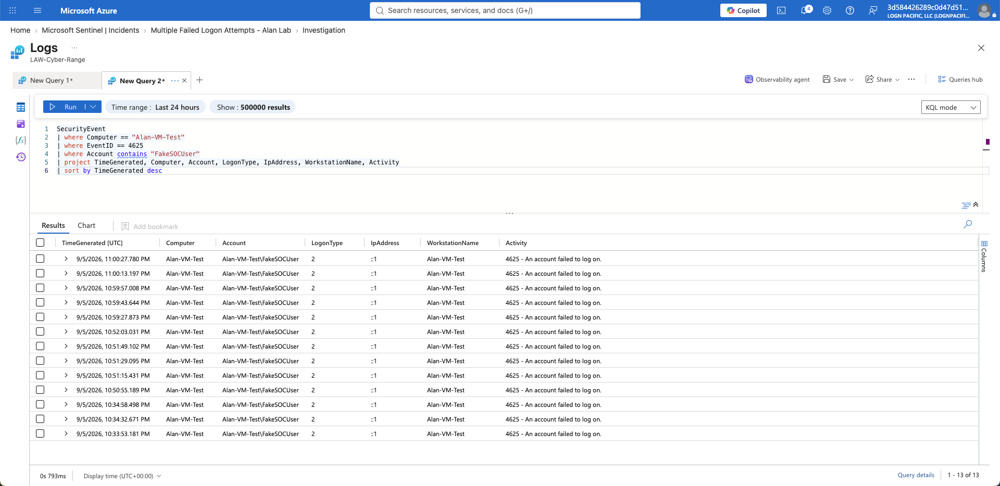

# Log Collection and KQL

## Overview

After configuring the Windows 11 virtual machine, the next step was to collect Windows Security Event logs and make them available for analysis in Microsoft Sentinel.

Windows security events generated on the virtual machine were collected through Azure Monitor and sent to the Log Analytics workspace used by Microsoft Sentinel.

This allowed me to use Kusto Query Language (KQL) to search and analyze security activity from the endpoint.

---

## Windows Security Event Collection

The **Windows Security Events via AMA** data connector was used to collect Windows Security Event logs from the virtual machine.

The connector uses the Azure Monitor Agent (AMA) and Data Collection Rules (DCRs) to route Windows Security Events into Azure Monitor Logs for analysis.

The log collection process used throughout the lab was:

**Windows 11 VM → Azure Monitor Agent → Data Collection Rule → Log Analytics Workspace → Microsoft Sentinel**

The Windows Security Events via AMA connector showed a **Connected** status and confirmed that Windows Security Event data was being received.



---

## Azure Monitor Data Collection

The Cyber Range environment uses Azure Monitor Data Collection Rules to control how telemetry from monitored resources is collected and routed to Log Analytics.

The Azure Monitor graph view provided a visual representation of the Cyber Range's broader data collection environment, including monitored resources, collected data, and Log Analytics destinations.

This helped demonstrate how endpoint telemetry moves through Azure Monitor before becoming available for security monitoring and analysis.



*Azure Monitor Data Collection Rules graph view showing the Cyber Range log collection architecture and Log Analytics destinations.*

---

## Verifying Log Collection with KQL

After confirming that Windows Security Events were being collected, I used Kusto Query Language (KQL) in Log Analytics to verify that security telemetry from the Windows 11 virtual machine was available for analysis.

The `SecurityEvent` table contains Windows Security Event data collected from the endpoint.

A basic query can be used to view events associated with the lab virtual machine:

```kusto
SecurityEvent
| where Computer == "Alan-VM-Test"
| sort by TimeGenerated desc
| take 50
```


This confirmed that Windows security telemetry from the virtual machine was available in Log Analytics.

---

## Investigating Failed Logon Events

To generate authentication activity for the lab, I intentionally performed failed authentication attempts using the test account:

`FakeSOCUser`

These failed authentication attempts generated:

**Windows Security Event ID 4625 — An account failed to log on**

I then used KQL to locate the corresponding events in Log Analytics.

```kusto
SecurityEvent
| where Computer == "Alan-VM-Test"
| where EventID == 4625
| where Account contains "FakeSOCUser"
| project TimeGenerated, Computer, Account, LogonType, IpAddress, WorkstationName, Activity
| sort by TimeGenerated desc
```

The query progressively filtered the security telemetry by:

- Virtual machine
- Windows Security Event ID
- Test account

It then displayed fields useful for investigating the authentication activity, including:

- `TimeGenerated`
- `Computer`
- `Account`
- `LogonType`
- `IpAddress`
- `WorkstationName`
- `Activity`

The query returned **13 failed logon events** associated with the `FakeSOCUser` test account.



---

## Analyzing the Event Data

The KQL results confirmed that the failed authentication attempts generated on the Windows endpoint were successfully collected and available for investigation in Log Analytics.

The results showed:

- **Computer:** `Alan-VM-Test`
- **Account:** `Alan-VM-Test\FakeSOCUser`
- **Event ID:** `4625`
- **Logon Type:** `2`
- **IP Address:** `::1`
- **Workstation:** `Alan-VM-Test`
- **Activity:** `4625 - An account failed to log on`

This demonstrated the connection between activity occurring on the Windows endpoint and the security telemetry available to a SOC analyst through Microsoft Sentinel and Log Analytics.

---

## KQL Investigation Workflow

This portion of the lab demonstrated a basic SOC log analysis workflow:

**Generate Security Activity → Collect Endpoint Telemetry → Query Logs → Filter Relevant Events → Analyze Results**

Instead of reviewing individual Windows events manually, KQL allowed me to search the collected telemetry and isolate events associated with the simulated failed authentication activity.

This type of filtering and analysis is an important part of SOC investigations because analysts often work with large volumes of security telemetry and must narrow the data to activity relevant to an investigation.

---

## Key Takeaways

This portion of the lab provided hands-on experience with:

- Collecting Windows Security Event logs
- Working with Azure Monitor Agent (AMA)
- Understanding Data Collection Rules
- Routing security telemetry to Log Analytics
- Querying the `SecurityEvent` table
- Writing and refining KQL queries
- Filtering security events by computer, Event ID, and account
- Investigating Windows Security Event ID 4625
- Identifying failed authentication activity
- Connecting endpoint activity to centralized SOC monitoring

The collected telemetry and KQL queries created the foundation for the next stage of the lab: **creating Microsoft Sentinel detections and investigating security incidents.**
